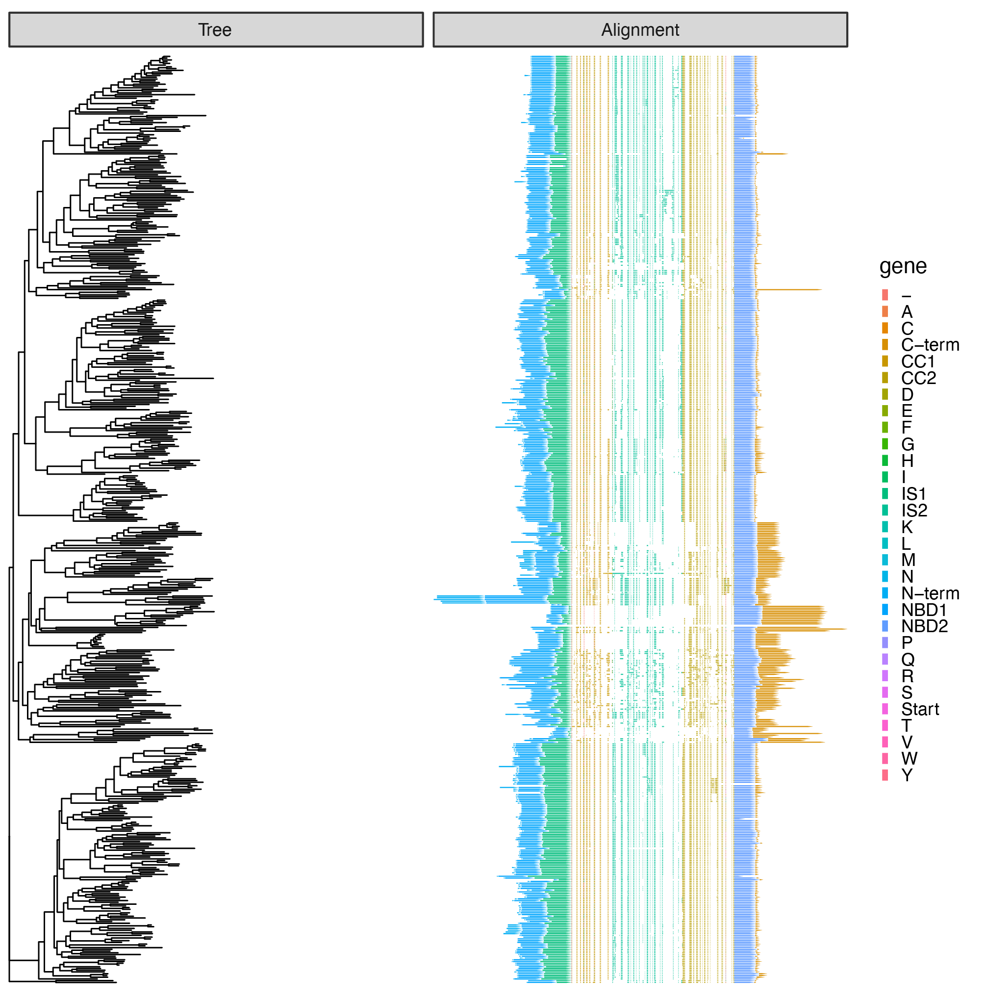

# MSA2genemap

Author: Murat Buyukyoruk

    MSA2genemap help:

This script is developed to generate a dataframe by using the MSA file that can be used with Phylo_2_genemap script. 

Syntax (one of the command lines from simpler to more advanced):

    python MSA2genemap.py -i demo.fasta -o out.txt                                                          #This will generate a dataframe to visualize all residues of an alignment.
    
    python MSA2genemap.py -i demo.fasta -o out.txt -k demo_key.txt                                          #This will generate a dataframe where each residue is colored by the corrsponding domain.
    
    python MSA2genemap.py -i demo.fasta -o out.txt -k demo_key.txt -s CC1 IS2 CC2                           #This will generate a dataframe where only specified domains are expanded while the rest are collapsed.
    
    python MSA2genemap.py -i demo.fasta -o out.txt -k demo_key.txt -s CC1 IS2 CC2 -r demo_residue.txt       #This will generate a dataframe where some residued can be highlighed unless they are locaed in a collapsed domain.
        
### Input file example:

Example dataframe for the key file (tab separated excel file is required):

    Accession       Position    Key
    WP_001007866.1	1-5         N-term
    WP_001007866.1	6-101	    NBD1
    WP_001007866.1	102-199	    IS1
    WP_001007866.1	200-239	    CC1
    WP_001007866.1	240-292	    IS2
    WP_001007866.1	293-350	    CC2
    WP_001007866.1	351-435	    NBD2
    WP_001007866.1	436-464	    C-term

Example dataframe for the residue file (tab separated excel file is required):

    Accession       Residue
    WP_001007866.1	212
    WP_001007866.1	213
    WP_001007866.1	224
    WP_001007866.1	345
    WP_001007866.1	346

### Output files

As an output, dataframe file(s) will be generated which is compatible with [Phylo_2_genemap.py](https://github.com/mbuyukyoruk/Phylo_2_genemap) script. Depending on the used arguments one or two files will be generate.
User defined output file will generate an unedited dataframe file where each residue/domain is represented with each line along with their GAPs in the alingment multifasta. If "-s Domain1 Domain2" option was used (requires "-k key.txt" file) an additional file will be generated that contains the adjusted domain boundries to expand the requested domains in the final figure generated by Phylo_2_genemap.

The format of .clst file will look like:

    molecule        ORF             gene	Residue     start	end     strand	    orientation
    WP_000334847.1	WP_000334847.1	N-term	NA	    1263	1267	forward	    1
    WP_000334847.1	WP_000334847.1	NBD1	NA	    1268	1373	forward	    1
    WP_000334847.1	WP_000334847.1	IS1     NA	    1374	1503	forward	    1
    WP_000334847.1	WP_000334847.1	Start	NA	    1503	1504	forward	    1
    WP_000334847.1	WP_000334847.1	CC1     F	    1504	1505	forward	    1
    WP_000334847.1	WP_000334847.1	CC1     D	    1505	1506	forward	    1
    WP_000334847.1	WP_000334847.1	GAP     -	    1506	1524	forward	    1
    WP_000334847.1	WP_000334847.1	CC1     V	    1524	1525	forward	    1
    WP_000334847.1	WP_000334847.1	CC1     E	    1525	1526	forward	    1
    ...

## How to use the output with [Phylo_2_genemap](https://github.com/mbuyukyoruk/Phylo_2_genemap)

Example usage of Phylo_2_genemap with this dataset is provided below:

    Phylo_2_genemap.py -t demo_tree.newick -o phylogeny -a Start -g out_CC1_IS2_CC2.txt         #use output file from MSA2genemap for -g argument.

Example output:

### MSA2genemap dependencies:

R                                                       refer to https://rstudio-education.github.io/hopr/starting.html

tqdm                                                    refer to https://pypi.org/project/tqdm/

ali2csv                                                 provided in this repository

pandas                                                  refer to https://pandas.pydata.org/

Bio module, SeqIO and Seq available in this package     refer to https://biopython.org/wiki/Download

Input Paramaters (REQUIRED):
----------------------------
	-i/--input      MSA                 Specify input file of a multiple-sequence alignment (MSA) file.

	-o/--output     outfile             Specify a output file name.

Parameters [optional]:
----------------------

	-k/--key        Key_file            Specify a key file containing a reference accession, residue positions and domain name to use it as reference to the rest of the MSA.

	-s/--show_dom   DOMAIN_name         Specify a list of domain names (separated with blank space, i.e., Domain1 Domain2) to expand these domains, while collapsing the rest.

	-r/--residue    Residue_file        Specify a residue file containing the reference accession and the residue positions that you would like to highlight.

Basic Options:
--------------
	-h/--help       HELP                Shows this help text and exits the run.
